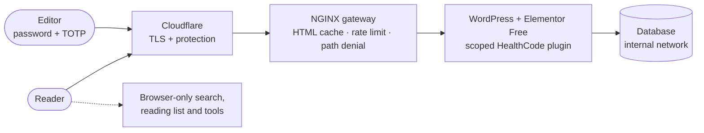

<h1 align="center">HealthCode Analysis</h1>

<p align="center">
  A medical-technology editorial publication built on <b>native WordPress + Elementor Free</b>.<br>
  Editable layouts, browser-only educational tools, a hardened origin, and documented limits for everything that is not yet proven.
</p>

<p align="center">
  <a href="https://healthcodeanalysis.zahidul-islam.com"><b>Live site</b></a> ·
  <a href="docs/README.md">Documentation</a> ·
  <a href="docs/ARCHITECTURE.md">Architecture</a> ·
  <a href="docs/ROADMAP.md">Roadmap</a> ·
  <a href="SECURITY.md">Security</a>
</p>

<p align="center">
  
  
  
  
  
</p>

> **Demonstration notice.** HealthCode Analysis is an editorial and technology demonstration, not a healthcare service. It does not provide medical advice. See the [medical disclaimer](docs/legal/MEDICAL-DISCLAIMER.md).

## What it is

- **A publication:** articles, technology reviews, category hubs and a searchable library, in the "Neural Frontier" design (graphite, mint and copper, with an AI-illustrated neural hero and a scroll-controlled film).
- **Editable by non-developers:** 66 native Elementor Free layouts with **zero HTML widgets**, plus editable header and footer templates. Elementor Pro is not required.
- **Private by design:** library search, the reading list and six educational tools (BMI, eGFR, AF score, PICO worksheet, prompt studio, image workbench) run **in the browser**. There is no analytics, advertising or tracking.
- **Hardened:** TOTP multi-factor login, rate-limited sign-in, a hash-based Content Security Policy, disabled XML-RPC/application passwords/author enumeration, and an internal-only database.
- **Honest about scale:** 10k–1M concurrent readers and 99% availability are **targets** with a staged plan and exit criteria. They are **not** measured results.

## Status

| Capability | Status |
|---|---|
| Native Elementor publication | **Live and verified:** editor round trip, 13 browser scenarios, 11 motion/accessibility states, 21 HTTP/security checks, MFA, 141-file SHA256 deployment parity ([record](wordpress-native/docs/VERIFICATION.md)) |
| Backup and isolated restore | **Verified** (68 pages, 156 valid layouts restored on a separate runtime) |
| Origin anonymous HTML cache | **Verified** (HIT/BYPASS behavior checked locally and publicly) |
| Owner visual acceptance | Pending |
| 10k → 1M concurrent readers | **Target:** [staged plan](docs/ROADMAP.md); no production load test yet |
| 99% availability SLO | **Target:** [SLO and error budget defined](docs/SCALABILITY-AND-RELIABILITY.md); no monitoring window yet |
| Legal operation for a real business | **Gated:** [compliance register](docs/legal/COMPLIANCE-REGISTER.md); collection features disabled |

## Architecture



| Layer | Where |
|---|---|
| **Frontend (live):** Elementor layouts, scoped plugin, browser modules | [`wordpress-native/`](wordpress-native/README.md) |
| **Frontend (design source and rollback):** Neural Frontier templates, styles, data | [`frontend/`](frontend/README.md) |
| **Backend:** WordPress runtime, NGINX gateway, policy data, compose | [`wordpress-native/`](wordpress-native/README.md) |
| **Retained services:** AskMe Worker (still reachable through the legacy `healthcodeanalysis.pages.dev` snapshot), automation toolkit, legacy Docker stack, static rollback container | [`workers/askme/`](workers/askme/README.md), [`scripts/`](scripts/README.md), [`docker/`](docker/README.md), [`deploy/shared-vps/`](deploy/shared-vps/README.md) |

Details: [docs/ARCHITECTURE.md](docs/ARCHITECTURE.md).

## Quick start

```bash
git clone https://github.com/Zahidulislam2222/healthcodeanalysis.git
cd healthcodeanalysis
python -m pip install -r requirements-dev.txt

# Preview the design source
python scripts/build_frontend.py && python scripts/preview_frontend.py

# Build the native Elementor layouts
python wordpress-native/scripts/build_native.py

# Run the offline checks
python -m unittest discover -s tests -p "test_native_*.py"
python -m unittest discover -s tests -p test_frontend.py
node --test frontend/tests/calculations.test.mjs
```

The full local WordPress setup and every quality gate are in [docs/DEVELOPMENT.md](docs/DEVELOPMENT.md).

## Scaling to 1M readers and 99% uptime

Reader traffic is read-only, so the scaling path is to push anonymous HTML and media to the CDN edge, then add redundant stateless origins and a replicated database for cache misses and editors. At the illustrative model's assumptions, one million concurrent readers means about **266,667 edge requests/second, but only ~2,667 origin requests/second**.

| Phase | Goal | Status |
|---|---|---|
| 0 Foundation | Native build, security, cache, restore | Done |
| 1 Observability | External probes, 30-day SLO measurement, restore drills | Planned |
| 2 Edge delivery | CDN HTML caching; 10k–100k qualified by load test | Planned |
| 3 Redundancy | Origin pool, database HA, failure drills | Planned |
| 4 Qualification | Staged load tests up to 1M | Planned |

Each phase has exit criteria and needs cost approval before any paid infrastructure is provisioned. See [ROADMAP.md](docs/ROADMAP.md) and [SCALABILITY-AND-RELIABILITY.md](docs/SCALABILITY-AND-RELIABILITY.md).

## Security, privacy and law

- **Security:** [policy and private reporting](SECURITY.md) · [threat model](docs/THREAT-MODEL.md) · [incident response](docs/INCIDENT-RESPONSE.md)
- **Privacy:** no analytics or tracking; [cookie and storage inventory](docs/legal/COOKIES-AND-STORAGE.md); [service providers](docs/legal/SUBPROCESSORS.md)
- **Law:** [compliance register](docs/legal/COMPLIANCE-REGISTER.md) covering GDPR/UK GDPR, ePrivacy, the EU AI Act, MDR, HIPAA, FTC rules, US state health-data laws, CCPA, COPPA, ADA/WCAG and Bangladesh's PDPA; [AI transparency](docs/legal/AI-TRANSPARENCY.md); [accessibility](docs/legal/ACCESSIBILITY.md)
- **Operations:** [runbook](docs/OPERATIONS-RUNBOOK.md) · [backup and disaster recovery](docs/BACKUP-AND-DISASTER-RECOVERY.md)

The legal documents are engineering-prepared registers and templates, **not legal advice**. A real operator must complete them and have them reviewed.

## Testing

**316 offline checks pass locally** (24 September 2026): 11 native contracts, 7 frontend build, 5 calculation, 11 static export, 1 admin header and 281 retained automation checks. The retained AskMe Worker test currently fails on a harness issue ([DEFECT-LOG.md](DEFECT-LOG.md)). Two integration suites need a live local stack. Full table: [tests/README.md](tests/README.md).

CI workflows exist but are manual and guarded by the `HEALTHCODE_ACTIONS_ENABLED` repository variable. No CI run is claimed.

## Project history

The project began as a **WordPress Elementor automation engine**: clone a template site per customer on cPanel, and swap photos, text and SEO metadata with one command (281 offline checks). It then added a static Cloudflare Pages publication with the AskMe chatbot, and became today's native Elementor publication. The automation toolkit is retained and documented in [scripts/README.md](scripts/README.md). See [CHANGELOG.md](CHANGELOG.md).

## Contributing and support

[CONTRIBUTING.md](CONTRIBUTING.md) · [CODE_OF_CONDUCT.md](CODE_OF_CONDUCT.md) · [SUPPORT.md](SUPPORT.md)

## License

Source code: [MIT](LICENSE). Fonts, platforms and dependencies: see [THIRD-PARTY-NOTICES.md](THIRD-PARTY-NOTICES.md).
