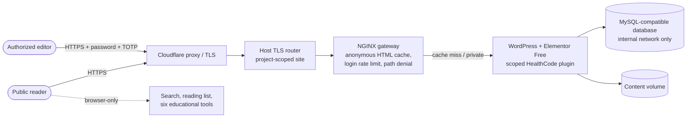

# Architecture

**Audience:** developers, reviewers and technical clients.
**Status labels used here:** **Live** (serving the public today), **Retained** (in the repository, not in the public request path), **Planned** (designed, not built or not deployed).

HealthCode Analysis is a medical-technology editorial publication built on native WordPress + Elementor Free, with a preserved static design source, browser-only educational tools and retained automation tooling. This document describes how the pieces fit, who owns which state, and where the trust boundaries are. Capacity and availability targets are in [SCALABILITY-AND-RELIABILITY.md](SCALABILITY-AND-RELIABILITY.md); security analysis is in [THREAT-MODEL.md](THREAT-MODEL.md).

## 1. System context

| Component | Status | Location in repository | Responsibility |
|---|---|---|---|
| Native WordPress runtime | **Live** | `wordpress-native/compose.yaml`, `wordpress-native/plugin/` | Serves the publication; editors author in Elementor Free. |
| NGINX gateway | **Live** | `wordpress-native/templates/nginx.conf.j2`, `wordpress-native/data/delivery.json` | Anonymous HTML cache, private bypass, login rate limit, denial of hidden/backup/config paths. |
| Host TLS router (Caddy) | **Live** | `wordpress-native/templates/site.caddy.j2` | Terminates origin TLS for the project hostname only. |
| Cloudflare proxy | **Live** | External service | Public TLS, DDoS mitigation, connection-level protection. HTML is **not** edge-cached today. |
| Neural Frontier static frontend | **Retained** (design source + rollback) | `frontend/`, `scripts/build_frontend.py` | Original approved design; source of the native migration; rollback target. |
| Static rollback container | **Retained** | `deploy/shared-vps/` | Read-only, non-root NGINX container that served the static release. |
| Legacy static snapshot | **Retained** (still publicly reachable) | `scripts/export_static_site.py`, `scripts/publish-static-site.ps1` | An older WordPress export from the automation phase ("MediCare Plus" demo customer) on Cloudflare Pages. It is not the current publication and is not updated by the native release. |
| AskMe Worker | **Retained, still public**: not used by the native site, but still publicly reachable through the legacy `healthcodeanalysis.pages.dev` snapshot (`/askme-proxy`) | `workers/askme/` | Cloudflare Worker retrieval chatbot over a bundled public content index. |
| Automation toolkit | **Retained** | `scripts/`, `configs/`, `tests/` | Customer config → validated plan → Elementor content/media/SEO swap via the WordPress REST API. |
| Local development stack | **Retained** | `docker/` | Original local WordPress stack for the automation toolkit. |
| Edge HTML cache, redundant origins, DB HA, external monitoring | **Planned** | [ROADMAP.md](ROADMAP.md) | Needed for the 10k–1M reader and 99% availability targets. |

## 2. Frontend

"Frontend" in this project means two related things:

1. **What readers see (Live):** WordPress renders pages built from Elementor Free containers and core widgets (heading, text, image, button, video). The build uses **zero HTML widgets**. A small scoped plugin (`wordpress-native/plugin/`) adds the parts standard widgets cannot express: 28 library-filter widgets, six educational-tool shortcodes, publication metadata and security headers.
2. **The design source (Retained):** `frontend/` holds the approved Neural Frontier design as Jinja templates, CSS, ES modules, maintained JSON content and locally served fonts. `wordpress-native/scripts/build_native.py` compiles it into Elementor layouts once; after import, **WordPress owns the editable content**.

Browser behavior (both variants):

| Feature | Where it runs | Data leaving the browser |
|---|---|---|
| Library search / "Ask the library" | Browser, over a downloaded public index | None beyond fetching the public index. |
| Reading list | Browser `localStorage` (one key) | None. |
| BMI, eGFR, AF score, PICO worksheet, prompt studio, image workbench | Browser | None intentionally sent; image processing is local. |
| Hero film | Browser video with HTTP range requests | Standard media requests; skipped on reduced motion / narrow screens. |

## 3. Backend

| Layer | Implementation | Key properties |
|---|---|---|
| Gateway | NGINX (non-root, read-only, capabilities dropped, loopback-bound) | 30 s public cache + 30 s stale-while-revalidate; cache lock; bounded cache (128 MB); login limited to 10 req/min per real client (requires the production `trusted_proxy_cidrs` deployment parameter; see the runbook); config/hidden/backup paths denied; uploaded PHP never executed. |
| Application | WordPress + Elementor Free + ACF + Two Factor + Ultimate Addons header/footer builder | Application passwords, XML-RPC, comments/pings, author enumeration and file editing disabled; unauthenticated REST user listing rejected. |
| Database | MySQL-compatible database (image pinned via environment) on an internal-only Docker network | Not publicly reachable; readiness requires an authenticated TCP query. |
| Resource bounds | Compose CPU/memory limits per service | Protect the shared host; **do not** provide horizontal scaling. |
| Configuration | Typed loader `wordpress-native/scripts/native_settings.py`, `.env.example`, `wordpress-native/data/*.json` | No credentials in source; feature flags and policy in data files. |

The retained **AskMe Worker** (`workers/askme/src/index.js`) accepts `POST` (and `OPTIONS` for CORS preflight), answers content questions from a bundled public index, uses Dialogflow ES solely for greetings/chit-chat, and holds its Google service-account key in Cloudflare secrets. It is not in the native reader path, but it is still publicly reachable through the legacy `healthcodeanalysis.pages.dev` snapshot (`/askme-proxy`), and greetings are sent to Google Dialogflow.

## 4. State ownership

| State | Owner | Rule |
|---|---|---|
| Page content and layouts after import | WordPress database (editors) | Never re-import generated layouts over newer editor changes without exporting/reconciling first. |
| Application behavior, policy, delivery limits | Git (source + `wordpress-native/data/`) | Changed by pull request; deployed local-first with parity checks. |
| Secrets | Environment files and secret stores (not Git) | `.env.example` lists names only. |
| Reader reading list | Reader's browser | Never sent to the server. |
| Uploads/media | Content volume + backups | Included in restore drills. |

## 5. Request lifecycle

**Anonymous reader:** Cloudflare → Caddy → gateway. If the request has no cookies, no `Authorization`, no query string, is a read method and is not a private route, the gateway may serve a cached copy (HIT) or fetch from WordPress and store it (MISS). Responses that set cookies are never stored.

**Editor:** the same path, but the authentication cookie forces BYPASS; every request reaches WordPress. Login attempts pass the rate limiter; a TOTP second factor is required.

**Private routes** (for example the reading-list page) are served `private, no-store`.

## 6. Deployment topology

The live site is a single origin on a shared virtual server, fronted by Cloudflare. The static release it replaced is kept on the same host for routing rollback. There is **one** origin and **one** database instance: this is a single point of failure, which is why availability is a target and not a measured claim. See [ROADMAP.md](ROADMAP.md) phases 2–4 for the path to redundancy.

Deployment follows a local-first procedure described in [OPERATIONS-RUNBOOK.md](OPERATIONS-RUNBOOK.md): drift check → local build and verification → backup → restore into an isolated runtime → routing activation with automatic rollback → SHA256 parity check.

## 7. Key design decisions

| Decision | Why | Trade-off |
|---|---|---|
| Native Elementor Free instead of HTML widgets or iframes | Editors can change real content with the standard tool; no Pro licence dependency. | A migration compiler plus a small plugin for behavior widgets cannot express. |
| Browser-only tools and search | No health inputs reach a server, which shrinks the privacy and breach surface. | Search quality is limited to lexical matching over a public index. |
| Origin HTML cache with strict bypass rules | Cuts PHP work for anonymous readers without risking private-data caching. | 30 s staleness; invalidation must be coordinated with Elementor CSS regeneration. |
| Hash-based CSP for registered scripts | Cacheable HTML without `unsafe-inline` scripts. | Inline styles are still allowed because Elementor requires them. |
| Demonstration mode with collection features off | No analytics, ads, affiliates, newsletter, accounts or health-data collection means no consent or processor obligations for those features today. | Each feature needs a legal, security and data-flow review before it is enabled ([legal/COMPLIANCE-REGISTER.md](legal/COMPLIANCE-REGISTER.md)). |
| Retain the static design and rollback container | Fast visual comparison and a proven fallback. | Two design sources must not drift; WordPress is authoritative for content. |

## 8. Related documents

- [SCALABILITY-AND-RELIABILITY.md](SCALABILITY-AND-RELIABILITY.md): capacity model, staged scaling, 99% SLO.
- [THREAT-MODEL.md](THREAT-MODEL.md): assets, trust boundaries, threats and controls.
- [OPERATIONS-RUNBOOK.md](OPERATIONS-RUNBOOK.md) and [BACKUP-AND-DISASTER-RECOVERY.md](BACKUP-AND-DISASTER-RECOVERY.md).
- [PUBLIC-TECHNICAL-OVERVIEW.md](PUBLIC-TECHNICAL-OVERVIEW.md): the long-form release narrative and evidence.
