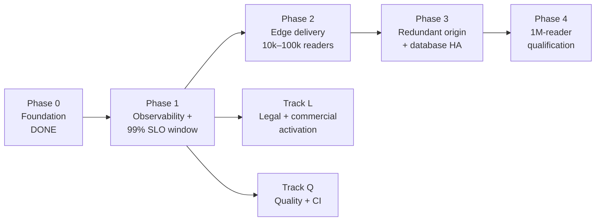

# Roadmap

**Status:** forward-looking plan. Nothing in the **Planned** phases is built or measured yet. A phase is complete only when its exit criteria have evidence (test output, monitoring data, restore records), not when code or a diagram exists.

**Last reviewed:** 24 September 2026.

## Where the project is today

| Area | State |
|---|---|
| Native Elementor Free publication | Live and verified (editor round trip, 13 browser scenarios, 21 HTTP/security checks, MFA, 141-file deployment parity). |
| Owner visual acceptance | Pending. |
| Capacity | Single origin, single database. Origin HTML cache implemented. **No production load test.** |
| Availability | No external monitoring window yet. **99% is a target, not a result.** |
| Legal | Demonstration mode: no analytics, ads, affiliates, newsletter, public accounts or health-data collection. Operator identity not yet assigned for a commercial launch. |
| CI | Workflows exist but are manual and guarded (`HEALTHCODE_ACTIONS_ENABLED`). |

## Phase overview

## Phase 0: Foundation (complete)

- Native Elementor Free migration with zero HTML widgets; editable header and footer.
- Security baseline: MFA, disabled XML-RPC/application passwords/author enumeration, CSP with script hashes, login rate limiting, path denial.
- Origin anonymous HTML cache with private bypass.
- Tested backup and isolated restore; routing rollback; SHA256 deployment parity.
- US/EU applicability research and demonstration feature gates.

## Phase 1: Observability and the 99% SLO window (planned, next)

**Goal:** know the real availability and performance of the live site.

| Work item | Detail |
|---|---|
| External synthetic probes | At least two independent locations; check TLS validity, HTTP status and a page marker within a deadline. |
| SLO dashboard | Rolling 30-day success ratio against the 99% target; show monitoring gaps separately. |
| Alerting | Page on sustained probe failure; ticket on error-budget burn rate. See [INCIDENT-RESPONSE.md](INCIDENT-RESPONSE.md). |
| Origin metrics | CPU, memory, PHP workers, DB connections, cache HIT ratio, p50/p95/p99 latency. |
| Public status page | Publish incidents and maintenance honestly. |
| Restore drill cadence | Quarterly isolated restore with timed RTO/RPO ([BACKUP-AND-DISASTER-RECOVERY.md](BACKUP-AND-DISASTER-RECOVERY.md)). |
| Housekeeping | Remove the duplicate `Strict-Transport-Security` header observed on 24 September 2026 (it is sent twice with the same value; harmless but untidy). |

**Exit criteria:** 30 consecutive days of external probe data; the measured SLI is published whether or not it meets 99%; one timed restore drill recorded.

## Phase 2: Edge delivery, 10k–100k concurrent readers (planned)

**Goal:** anonymous readers are served from the CDN edge, not PHP.

| Work item | Detail |
|---|---|
| Choose the publication strategy | Either (a) CDN HTML caching with strict bypass rules, or (b) a static snapshot generated from WordPress on publish. Elementor stays the authoring tool in both. |
| Cache safety tests | Cookie/authorization/query bypass, cache poisoning, purge and invalidation. |
| Asset strategy | Immutable versioned assets; separate media budget for the hero film; image sizing. |
| Edge security | WAF managed rules and bot controls reviewed for false positives. |
| Load test (10k) | Authorized, gradual k6 test against a production-like **staging** environment, never the shared live host. |

**Exit criteria:** k6 thresholds pass at the 10k workload defined in [`capacity-plan.json`](../wordpress-native/data/capacity-plan.json) with a published report (release hash, duration, geography, errors, latency percentiles, generator saturation). Edge hit ratio is measured, not assumed.

## Phase 3: Redundant origin and database high availability (planned)

**Goal:** losing one origin or the database primary does not take the site down.

| Work item | Detail |
|---|---|
| Shared state | Move uploads to object storage and sessions/object cache off local disk before adding replicas. |
| Origin pool | Two or more origins behind health-checked load balancing. |
| Database | Primary/replica with tested failover, or a managed database with a documented recovery point. |
| Authoring isolation | The editor path is protected from reader traffic spikes. |
| Failure drills | Kill one origin, fail the database primary and roll back a bad deploy, each under load. |

**Exit criteria:** failure drills recorded with observed downtime; RTO/RPO targets met in at least two consecutive drills.

## Phase 4: 1M concurrent-reader qualification (planned)

**Goal:** evidence, not assertion, that the delivery path handles the target.

The illustrative model estimates about **266,667 edge requests/second, 2,667 origin requests/second and 133 Gbit/second** at one million readers. These figures come from assumptions (30 s page interval, 8 requests per page, 99% edge hit ratio, 500 kB per view), not measurements. See [SCALABILITY-AND-RELIABILITY.md](SCALABILITY-AND-RELIABILITY.md).

| Work item | Detail |
|---|---|
| Provider review | Written confirmation of CDN plan limits, bandwidth terms and burst handling at this volume. |
| Distributed load generation | Multi-region generators with enough capacity to avoid saturating the test itself. |
| Staged ramps | 100k → 250k → 500k → 1M, with cold-cache, purge-storm and origin-failure scenarios at each step. |
| Media | Separate test for hero film delivery; consider adaptive or poster-only delivery at peak. |

**Exit criteria:** a published qualification report at each step. The words "handles 1M concurrent readers" may be used only for the configuration and workload that passed.

**Cost warning:** Phases 2–4 require paid infrastructure and load-generation capacity. No resource is provisioned by this roadmap. Each phase needs a written cost estimate and explicit budget approval first.

## Track L: Legal and commercial activation (planned; per feature)

Each item stays **off** until its gate in [legal/COMPLIANCE-REGISTER.md](legal/COMPLIANCE-REGISTER.md) is satisfied.

1. Assign the legal operator, establishment, and privacy/accessibility/corrections contacts.
2. Replace demonstration notices with operator-specific policies (templates in [legal/](legal/)); obtain qualified legal review.
3. Editorial verification: claim checks, authorship, image rights, and a corrections log before any article is indexed as verified.
4. Analytics or advertising: data-flow map, consent mechanism with real pre-consent blocking, and processor contracts.
5. Newsletter: permission basis, unsubscribe, suppression and retention.
6. Public accounts: authorization tests, recovery, deletion/export, abuse controls.
7. Any health-data collection or AI model integration: regulatory qualification (HIPAA, FTC HBNR, state health-data laws, GDPR Art. 9, EU AI Act, MDR/FDA), a DPIA and contracts.

## Track Q: Quality and CI (planned)

| Item | Detail |
|---|---|
| Activate CI | Set `HEALTHCODE_ACTIONS_ENABLED=true` after reviewing runner minutes and billing; run the security workflow on every pull request. |
| Pin actions by SHA | Replace version tags with commit SHAs for supply-chain integrity. |
| Node runtime | CI pins Node 20, which has reached end of life; move to the current LTS line. |
| Fix the AskMe test harness | `workers/askme/test/content-search.test.mjs` fails under plain Node because the JSON import lacks `with { type: "json" }` and the generated index is not committed. See [DEFECT-LOG.md](../DEFECT-LOG.md). |
| Legacy lint debt | Eight Ruff findings remain in unchanged legacy scripts. |
| Machine-specific paths | `scripts/publish-static-site.ps1` and `scripts/export-healthcode-pages.ps1` contain absolute local paths; move them to configuration. |
| AskMe / legacy snapshot | Decide: decommission `healthcodeanalysis.pages.dev` and the AskMe Worker, or restrict CORS and add rate limiting. It is currently public. |
| Trusted proxy config | Move the production `trusted_proxy_cidrs` value into the typed environment and `.env.example`. |
| Docker port binding | `docker/docker-compose.yml` publishes local database/admin ports on all interfaces; bind them to `127.0.0.1`. |
| Accessibility audit | Manual screen-reader and physical-device review against WCAG 2.2 AA. |
| Resume Dependabot | Dependabot is paused (`open-pull-requests-limit: 0`); resume once CI can validate update pull requests. |

## Change control

- The roadmap is updated in the same pull request that completes or changes a phase.
- A changed workload, business model or data flow reopens the relevant security, privacy and capacity assumptions.
- A **Planned** item never becomes a claim in the README, proposals or marketing without its exit evidence.
