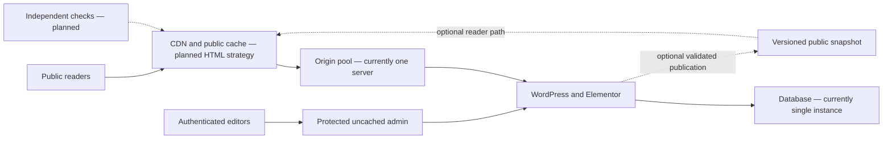

# Capacity and availability: targets, architecture and evidence

**Status: architecture roadmap. Not a demonstrated capacity claim or a contractual SLA.**

The target is 10,000–1,000,000 concurrent readers and a 99% availability SLO. Current measured maximum concurrency and long-term availability are **not established**. The single-server demo must not be presented as having passed those targets. Implementing the planned components alone would still not prove capacity; representative testing is required.

## Capability register

| Capability | Status | Evidence or remaining work |
|---|---|---|
| Preserved original design | VERIFIED | Source/rendered snapshot, 205 SHA256-verified files; private recovery record. |
| Native Elementor Free authoring | IMPLEMENTED AND VERIFIED | Representative editor save/restore and13 public interaction scenarios passed locally and publicly; owner visual acceptance remains. |
| Isolated local WordPress/database | IMPLEMENTED | Dedicated Compose project and volumes; not a high-availability cluster. |
| Browser-side search and educational tools | IMPLEMENTED | All six browser tool flows passed locally; no external requests in the exercised public flows. |
| 10k concurrent readers | TARGET, NOT MEASURED | Workload definition, capacity tests and delivery limits required. |
| 100k–1M concurrent readers | TARGET, NOT MEASURED | Edge delivery, redundancy, regional tests, quotas and operational funding required. |
| 99% availability | TARGET, NOT MEASURED | External observation window, incident history and failover evidence required. |
| Multiple origin replicas | PLANNED | Shared state and failover have not been deployed. |
| Database high availability | PLANNED | Replication, recovery and consistency have not been deployed. |
| Anonymous page cache | IMPLEMENTED AND VERIFIED | NGINX cache lock, bounded storage and explicit private-route bypass;21 local and public HTTP checks passed, including cache HIT and private headers. |
| Automatic scaling | PLANNED | No autoscaler or additional paid resources provisioned. |
| Bounded local HTTP smoke | VERIFIED LOCALLY |40/40 successful responses,4workers,40cacheHITs. [Measured artifact](../wordpress-native/docs/LOCAL-SMOKE-RESULTS.json); not production capacity. |
| High-load test results | NOT AVAILABLE | A local smoke test cannot establish production-scale capacity. |

## Define the workload first

Concurrent readers are people active during an interval. They are not the same as simultaneous network requests, requests per second, authenticated database sessions or live video streams. A page viewed once every 30 seconds creates a different load from continuous polling. State the geography, page mix, cache state, session behavior, media bytes, response sizes and arrival pattern with every capacity claim.

The configuration in [capacity-plan.json](../wordpress-native/data/capacity-plan.json) contains explicit **illustrative assumptions**, not observed user behavior. The offline [capacity model](../wordpress-native/scripts/capacity_model.py) converts those assumptions into request and bandwidth estimates. It performs no network requests and provisions nothing.

```bash
python wordpress-native/scripts/capacity_model.py wordpress-native/data/capacity-plan.json
```

At the illustrative 30-second interval, eight requests per page, 99% edge hit ratio and 500 kB per page view, one million readers imply approximately 266,667 edge requests/second, 2,667 origin requests/second and 133.3 Gbit/second delivered at the edge. These are arithmetic consequences of assumptions, **not a prediction that the current server or a free plan can handle them**. The 500 kB assumption excludes a fresh download of the multi-megabyte hero video; first-load/video-heavy traffic must be modeled separately. Asset reuse and range requests also change the result.

## Staged architecture



### Stage 1: establish a reliable baseline

Finish native editor and functional tests, security controls, restore tests and version parity. Measure ordinary request performance, memory, CPU, database connections, slow requests and page weight. Bound PHP concurrency and database resource use to prevent overload. Publish no concurrency claim from a successful HTTP check.

### Stage 2: scale anonymous publication traffic

Choose and validate either safe anonymous HTML caching or a static publication pipeline generated from the native WordPress content. Elementor remains the authoring system in either case. Preserve the approved design and verify publication output; do not hand-maintain a divergent public copy.

Cloudflare does not cache HTML by default. A proxied hostname therefore does not prove HTML requests avoid PHP. The native implementation now includes an anonymous HTML reverse-proxy cache and a hash-based CSP for WordPress-registered scripts. Twenty-one local HTTP security checks passed, including warm-cache HIT and private-route/query/cookie/authorization BYPASS. The public HTTPS release passed the same cache checks. Public responses are eligible only without queries, cookies or authorization; private responses remain uncached. This establishes a code-level scaling boundary, but does not configure or prove CDN HTML caching. Never cache authenticated HTML, previews, private data or CSRF-sensitive forms. Test cache poisoning, query variation and invalidation. [Cloudflare cache documentation](https://developers.cloudflare.com/cache/get-started/)

Use immutable versioned assets, compressed responses, appropriately sized images and a separate media traffic budget. Validate service terms, cache behavior and quotas for large video traffic. A free feature’s existence is not a promise of free delivery at the target volume.

### Stage 3: survive origin failure and cache misses

If origin-generated responses remain necessary, deploy redundant origins behind health-aware routing. Eliminate server-local assumptions for uploads and sessions before adding replicas. Choose the database replication/recovery design based on write rate and consistency requirements; copying containers does not replicate database state. Test the loss of one origin, the database primary, a deployment and a region where relevant.

Protect the authoring service independently from public reader traffic. A static public publication can remain available while WordPress is temporarily unavailable, but publication freshness then becomes another SLI. Any future accounts, subscriptions or patient workflows require a separate architecture and legal/security assessment.

### Stage 4: qualify each target

Run gradual, authorized load tests against a dedicated environment with production-representative topology. Measure cold and warm caches, cache purges, burst arrivals, sustained traffic, media downloads and bot traffic. Report dropped load-generator iterations and generator saturation, not just server latency. Validate failure and recovery under load. Record configuration, release hash, duration, geography, request mix, successful responses, latency percentiles and resource headroom.

Grafana k6 supports explicit pass/fail thresholds; a script is tooling, not evidence that it ran or passed. No large test should be pointed at the shared live server by default. [k6 thresholds](https://grafana.com/docs/k6/latest/using-k6/thresholds/)

## Availability SLO and error budget

**Proposed primary SLI:** successful synthetic public-page probes divided by all scheduled eligible probes, observed externally over a rolling 30-day window. A successful probe requires a valid TLS connection, expected HTTP status and expected page marker within the documented deadline. Report monitoring gaps separately; missing observations are not successful probes. Keep administrative availability and publication freshness as separate indicators.

**Target:** at least 99% successful eligible probes. This is an SLO, not a warranty or a client SLA. Where measured as continuous time, 99% over 30 days permits 432 minutes (7 hours 12 minutes) of unavailability. Probe sampling only estimates time availability, so do not confuse a request-based or sampled SLI with exact outage duration.

Define independent locations, schedule, timeout, retry treatment and incident ownership before starting the measurement window. Include maintenance in the public availability report unless an explicitly agreed contract states otherwise. Freeze risky feature releases when the agreed error budget is exhausted; prioritize remediation and recovery tests. [Google SRE: implementing SLOs](https://sre.google/workbook/implementing-slos/)

Backups protect recoverability, not instantaneous availability. Agree recovery point and recovery time targets only after representative restore tests. Multiple replicas without failure testing do not establish high availability. [WordPress performance guidance](https://developer.wordpress.org/advanced-administration/performance/optimization/)

## Client-facing wording

Permitted: “The project includes a staged architecture and validation plan targeting 10k–1M concurrent readers and 99% availability. Production-scale capacity and uptime are not yet verified.”

Not supported: “Handles one million simultaneous users,” “99% uptime guaranteed,” “enterprise autoscaling implemented,” or “free at any traffic level.” Replace these only when appropriate measurements and commercial commitments exist.

No additional paid resources, subscriptions or high-volume test services are authorized or provisioned by this roadmap. Future infrastructure and bandwidth costs require separate assessment and approval.

## Reproduce the bounded local check

The local-only tool validates its environment and request/concurrency bounds, disables environment proxies, and does not follow redirects. Its default plan sends40 requests with4 workers after a warmup. It measures anonymous HTTP/cache behavior only; it does not load browser assets or simulate40 simultaneous people.

```bash
python wordpress-native/scripts/local_smoke.py --environment wordpress-native/.env --plan wordpress-native/data/local-smoke.json --policy wordpress-native/data/publishing-policy.json
```

Keep [local-smoke.json](../wordpress-native/data/local-smoke.json) separate from the illustrative production capacity model. A successful local run does not qualify any production concurrency or availability target.
