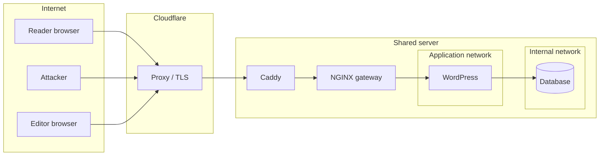

# Threat model

**Method:** STRIDE per trust boundary. **Scope:** the live native WordPress publication and the retained components in this repository. **Last reviewed:** 24 September 2026.

Controls are labelled **Implemented** (in code and verified by a named check), **Partial** or **Planned**. Static analysis and passing checks reduce risk; they do not prove the absence of vulnerabilities.

## 1. Assets

| Asset | Why it matters |
|---|---|
| Administrator accounts and sessions | Full control of published medical-technology content. |
| Published content integrity | Tampered health content can harm readers and the publisher's reputation. |
| Database and uploads | Content, accounts and media; recovery depends on them. |
| Deployment and cloud credentials | Server, DNS, CDN and Worker control. |
| Reader privacy | Connection metadata at the CDN/host; nothing else is intentionally collected. |
| Availability | Readers expect the publication to load. |

## 2. Trust boundaries

- **B1 Internet → Cloudflare:** untrusted input from any client.
- **B2 Cloudflare → origin:** the origin trusts client-address headers only from configured proxy ranges.
- **B3 Gateway → WordPress:** only eligible anonymous responses are cached; everything else passes through.
- **B4 WordPress → database:** internal Docker network, no public port.
- **B5 Browser-only tools:** reader inputs never cross B1 by design.

## 3. Threats and controls

| # | STRIDE | Threat | Control | Status |
|---|---|---|---|---|
| T1 | Spoofing | Password guessing or credential stuffing against `wp-login.php` | TOTP second factor required; login rate limit of 10/min per real client; generic login errors | Implemented (invalid-TOTP rejection and 28-request forged-header test verified) |
| T2 | Spoofing | Forged `X-Forwarded-For` / client-IP headers to evade the limiter | Outer router overwrites the application client-IP header; CDN connecting-address header accepted only from official CDN ranges | Implemented (17 of 28 forged requests limited with the real IP) |
| T3 | Tampering | Stored XSS through content or plugins | Hash-based CSP for scripts (no `unsafe-inline` scripts); `object-src 'none'`; `base-uri 'self'`; Jinja autoescaping in the design source | Partial: inline styles allowed for Elementor |
| T4 | Tampering | Cache poisoning or serving private pages from cache | Cache only anonymous `GET`/`HEAD` without cookies, authorization or query strings; never store responses that set cookies; private routes `no-store` | Implemented (21 HTTP checks, including BYPASS cases) |
| T5 | Tampering | Malicious upload executed as PHP | Gateway denies execution of PHP-like files in uploads; 20 MB upload ceiling | Implemented |
| T6 | Repudiation | Undetected administrative changes | Gateway/access logs; WordPress revisions | Partial: no central log retention or audit trail yet (roadmap Phase 1) |
| T7 | Information disclosure | Leaking config, backups, `.git`, or dotfiles | Gateway denies hidden, backup-like and configuration paths; no directory listing | Implemented |
| T8 | Information disclosure | User enumeration through REST or author archives | Unauthenticated REST user listing rejected; author enumeration disabled | Implemented |
| T9 | Information disclosure | Secrets committed to Git | `.env`/credential files ignored; repository pre-commit hook detects private keys; Gitleaks run manually on the staged diff, source tree and history | Partial: clean Gitleaks scans recorded for the 2026-09-14 release and this documentation release; Gitleaks is not yet in the repository pre-commit config or an active CI job |
| T10 | Information disclosure | Reader health inputs exposed | Tools and search run in the browser; nothing is intentionally transmitted; no analytics | Implemented (browser audit found no external requests in exercised flows) |
| T11 | Denial of service | Traffic floods exhaust PHP/database on a single origin | Cloudflare proxy; origin HTML cache with cache lock; per-service CPU/memory bounds | Partial: single origin; no edge HTML cache or autoscaling (roadmap Phases 2–3) |
| T12 | Denial of service | Expensive uncached requests (query strings, search) | Query strings bypass the cache and reach PHP; login limited | Partial: plan edge rate limiting for uncached paths |
| T13 | Elevation of privilege | Exploiting XML-RPC, application passwords or the file editor | All disabled in the native runtime | Implemented |
| T14 | Elevation of privilege | Vulnerable plugin or core version | Minor core auto-updates; official packages only (no nulled plugins); versions checked against official inventories | Partial: plugin updates are manual; no automated vulnerability feed yet |
| T15 | Elevation of privilege | Compromised CI or supply chain | Workflows manual and guarded; least-privilege `permissions`; Dependabot configured (paused) | Partial: actions pinned by tag, not SHA (roadmap Track Q) |
| T16 | Spoofing / abuse | Retained AskMe Worker abused as an open endpoint | `POST`/`OPTIONS` only; bounded retrieval over a public index; input length caps; Google key in Cloudflare secrets | **Current exposure:** not used by the native site, but still reachable through the legacy `healthcodeanalysis.pages.dev` snapshot (`/askme-proxy`) with CORS `*` and no rate limit; greetings are forwarded to Google Dialogflow. Decommission it or add origin restriction and rate limiting (roadmap Track Q) |
| T17 | Tampering | Retained legacy REST bridge (`scripts/healthcode-api-bridge.php`) used on a live site | Header-only API key, per-IP rate limits, path whitelist, prepared SQL | Retained and not installed on the native runtime; review before any reuse |

## 4. Residual risks accepted for the demonstration

- Single origin and single database (availability risk): documented as a target, not a claim.
- Inline styles permitted by CSP (Elementor constraint).
- No centralized security logging, SIEM or intrusion detection.
- No independent penetration test has been performed.

## 5. Review triggers

Re-run this model when any of these happen: a new plugin, public accounts, forms, analytics, payments, AI/model integration, health-data collection, a new hosting topology, or a security incident.
